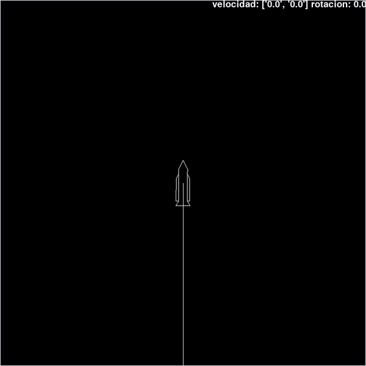

<div align="center">

# Rocket Orbit Sim

*A vector rocket launched from a real-scale Earth, with Newtonian gravity, inertial steering and a predicted trajectory redrawn every frame.*




</div>

## About

A 2D spaceflight sandbox at real scale, in two files: `planetas.py` ("planets") and `dibujo.py` ("drawing"). Earth is a circle 6 000 km in radius with a mass of $5.972 \times 10^{24}$ kg, and a 100 m vector-outline rocket starts 500 m above its surface with a thrust-to-weight ratio of about 1.8. You steer, burn and zoom out until the planet appears, while a line shows where the ship would coast with the engine off. The gravity, the integrator, the trajectory prediction and the renderer that draws only the visible arc of a planet millions of pixels wide are all written from scratch.

> [!NOTE]
> The on-screen readout is in Spanish: `velocidad` is the velocity $(v_x, v_y)$ in m/s and `rotacion` is the rotation in degrees.

## Quick start

```bash
python -m pip install -r requirements.txt
python planetas.py
```

## Controls

| Input | Action |
| --- | --- |
| <kbd>W</kbd> | Engine on while held. The engine is already on at start and only switches off after the first press and release |
| <kbd>A</kbd> / <kbd>D</kbd> | Spin up anticlockwise / clockwise while held; the spin carries on after release, so counter-steer to stop it |
| <kbd>+</kbd> / <kbd>-</kbd> | Zoom out / in by a factor of 2 |
| Close the window | Quit |

## How it works

- **Units and camera.** Positions are in metres with $y$ pointing up, and the camera stays centred on the ship. The zoom `escalaGlobal` is in metres per pixel and starts at 1, where the ground is still off-screen below the ship.
- **Forces.** Each frame the ship sums Newtonian gravity from every other object, with $G = 6.67 \times 10^{-11}$, and adds thrust along its heading. With the heading angle $\varphi$ measured from straight up:

  ```math
  \mathbf a = \sum_{\text{planets}} \frac{G M}{\lVert \mathbf x_p - \mathbf x \rVert^2}\,\frac{\mathbf x_p - \mathbf x}{\lVert \mathbf x_p - \mathbf x \rVert}
  \;+\; \frac{F}{m}\,(-\sin\varphi,\ \cos\varphi)
  ```

  The thrust gives $F/m = 1.6 \times 10^8\,\text{N} / 8 \times 10^6\,\text{kg} = 20$ m/s², against about 11.1 m/s² of gravity at the surface.
- **Integration.** Semi-implicit Euler, velocity first and then position, with simulated time running 10 times faster than the wall clock: $\Delta t = 10\,\Delta t_{\text{real}}$. Steering works the same way one level up: <kbd>A</kbd> and <kbd>D</kbd> set an angular acceleration of ±0.5 °/s², which builds up an angular velocity.
- **Trajectory prediction.** Every frame the ship's current state is copied and stepped 1000 times with gravity only and a 50 s step, about 14 hours ahead, and the result is drawn as a polyline. It shows where the ship would coast if the engine were cut.
- **Contact.** When the ship comes within its own radius of the planet's surface, its velocity is reset to zero, or to one frame of thrust if the engine is on. This serves as both landing and crash.
- **Drawing a huge planet.** At close zoom Earth's radius is millions of pixels, so `dibujarArco` does not ask Pygame for a circle. It starts at the point of the circle nearest the screen centre and walks along it in 20 px steps in both directions until it leaves the screen, then draws that arc as a polyline. Once the planet is small enough it is drawn as an ordinary circle.
- **The rocket** is a list of 17 `[angle, radius]` vertices converted to screen coordinates every frame; rotating the ship adds to every angle.

## Code map

| Path | Role |
| --- | --- |
| `planetas.py` | Main loop, keyboard input and HUD, the `Planeta` and `Sprite` classes, the physics and the trajectory prediction |
| `dibujo.py` | `Dibujador` renderer: the planet as a circle or a visible arc, the rocket polygon and the predicted path |

## Limitations

- `dibujo.py` prints the whole predicted trajectory and the camera position to the console every frame, about 14 KB of text per frame, which slows the program down.
- The engine is on from the first frame until <kbd>W</kbd> has been pressed and released once.
- <kbd>+</kbd> is read as `K_PLUS`, which only keyboards with a separate plus key (such as Spanish layouts) send. On a US layout, and on the numeric keypad, there is no way to zoom out.
- There is a single planet, no atmosphere and no real landing or crash: contact just stops the ship. The contact test adds the step to the planet's position instead of the ship's, so it effectively checks where the ship was one step earlier.
- The prediction ignores thrust and uses coarse 50 s steps. The step follows the wall clock in an uncapped loop, so the frame rate changes how accurately the flight itself is integrated.
- `Planeta.draw` and `Sprite.draw` in `planetas.py` are never called (the renderer in `dibujo.py` draws everything), and a commented-out `Nave` ("ship") class is left over.

## Background

Written in or before June 2023; the files come from a code backup made that month, where they sat in a scratch folder named `prueba` ("test"), and were put under version control in 2026. The rocket uses the same polar-vertex outline technique as the author's Asteroids game.

---

<div align="center"><sub>Part of <a href="https://github.com/lnivan">lnivan's projects</a> · <b>Simulations</b></sub></div>
